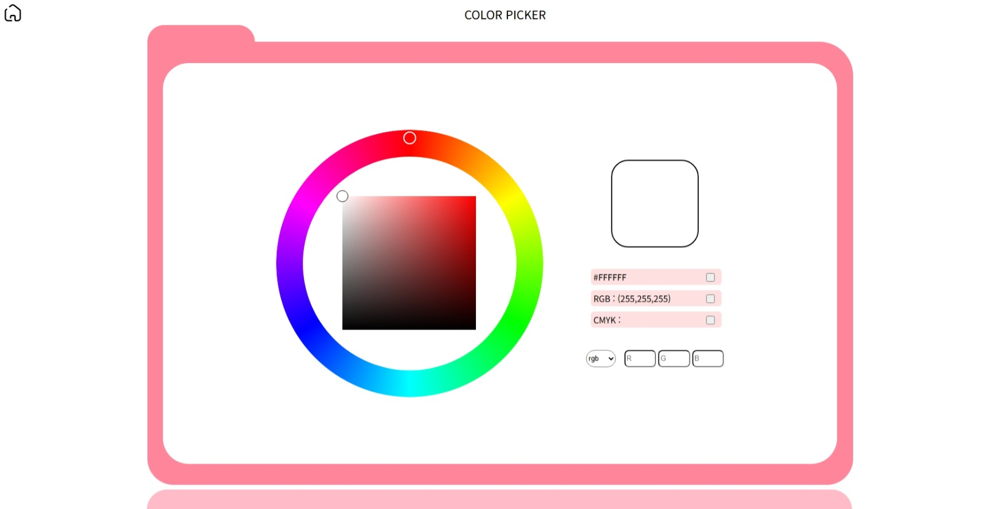
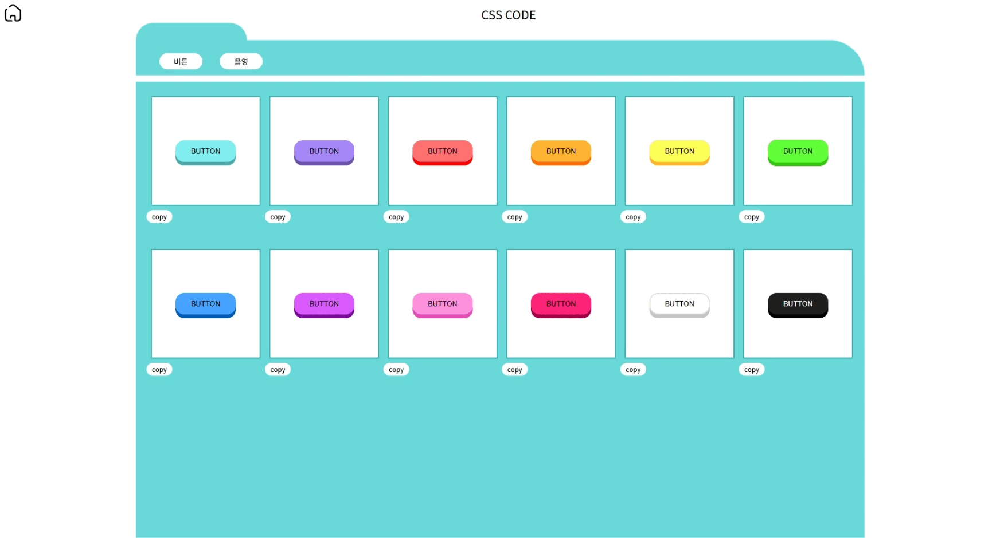

# project-nine

도구 모음 사이트 개선

## 개요

자주 쓰이는 도구들의 접근성을 높이기 위해 도구 모음 사이트를 제작한다. 간단한 색상 코드 변환기만 존재하던 [8번째 프로젝트](https://chocho030.github.io/project-eight/)를 개선하여 제작한다. 색상 코드 변환기의 기능을 추가하고 새로운 도구로 css 코드 복사 도구를 추가한다.

## 개선 사항

- css 코드 복사 도구를 추가한다.
- 파란색 이외의 다른 색 색깔 팔레트를 추가한다.

## 고민한 지점

1. 색상코드 변환기에서 hex 값이 변경됐을 때 한자리의 수는 십의 자리가 생략된 채 나오는 문제

2. 서브 팔레트의 색상 지정에 따른 결과값의 변경이 실시간으로 이루어지지 않는 문제

3. conic-gradient의 각도 지정이 예상과 다르게 변경되는 문제.

4. main-dot이 main-palette 영역을 벗어날 경우, mouseup을 인식하지 못하는 문제

5. rgb input에 입력 제한을 둘 수 없는 문제

## 기능

### 색상 팔레트

원하는 색상의 코드를 자유롭게 골라 복사할 수 있습니다.

### 스타일 복사기

원하는 스타일을 찾고 css 코드를 쉽게 복사할 수 있습니다.
